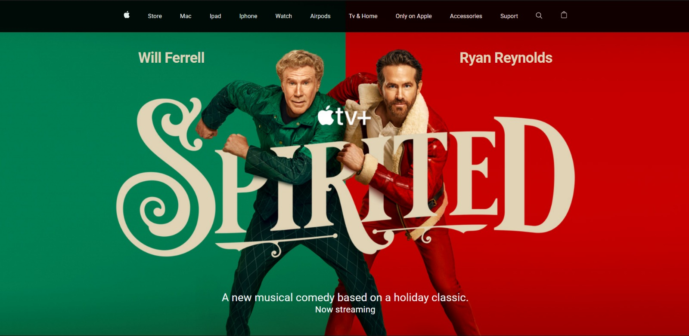

# Apple Website UI Clone

This project is a simple clone of the Apple website, built using only JavaScript and CSS.

## Installation

To install this project, follow these steps:

1. Clone the repository to your local machine using `git clone https://github.com/yourusername/appleWebsiteUIClone.git`
2. Navigate to the project directory using `cd appleWebsiteUIClone`
3. Open the `index.html` file in your preferred browser

## Running the Project

Once you have installed the project, you can run it by simply opening the `index.html` file in your browser. 

If you are using Visual Studio Code as your code editor, you can also use the Live Server extension to run the project. Live Server creates a development local Server with live reload feature for static & dynamic pages.

To use Live Server:

1. Install the Live Server extension from the [VSCode Marketplace](https://marketplace.visualstudio.com/items?itemName=ritwickdey.LiveServer).
2. Open the `index.html` file in VSCode.
3. Right-click on the file and select "Open with Live Server".

For more information, check out the [Live Server documentation](https://github.com/ritwickdey/vscode-live-server).

## Technologies Used

- JavaScript
- CSS
